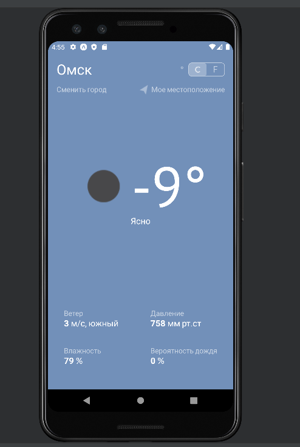
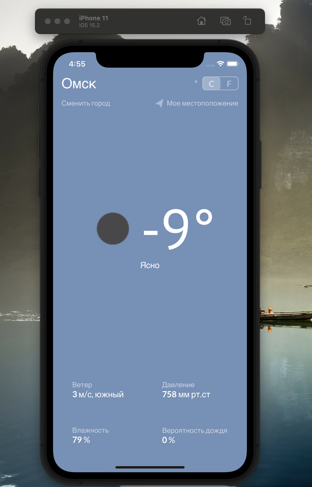

<h2>Screenshots</h2>

<ol>
    <li>Android
        <ul>
            <li>
                
            </li>
        </ul>
    </li>
    <li>IOS
        <ul>
            <li>
                
            </li>
        </ul>
    </li>
    <li>Open keyboard:
        <ul>
            <li>
                
            </li>
        </ul>
    </li>
    <li>Location
        <ul>
            <li>
                
            </li>
        </ul>
    </li>
        <li>Entering the wrong city
        <ul>
            <li>
                
            </li>
        </ul>
    </li>
</ol>